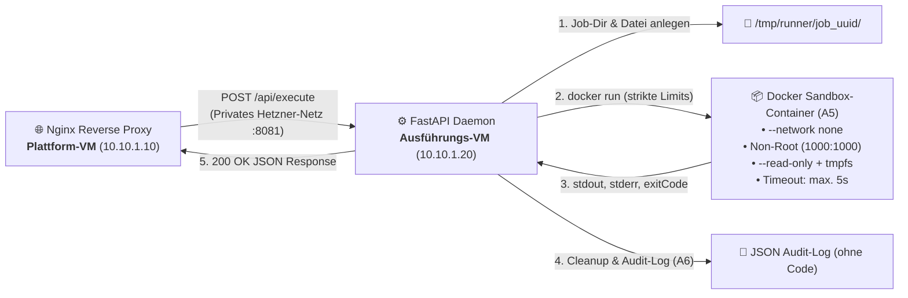

# ⚙️ Code Execution Service (Sandbox-Ausführungsdienst)

[](https://www.python.org/)
[](https://fastapi.tiangolo.com/)
[](https://www.docker.com/)
[](https://www.uvicorn.org/)
[](https://pytest.org/)
[](https://alpinelinux.org/)

> **Praxiskomponente der Bachelor-Praxisarbeit:**  
> *„Evaluation von Terraform und OpenTofu zur sicheren Bereitstellung isolierter Codeausführungsumgebungen in der Cloud“*  
> Realisiert die **Ausführungskomponente auf der internen Hetzner Cloud VM** zur Verifikation der Sicherheits- und Isolationsanforderungen (**A4, A5, A6**).

> [!NOTE]
> **Hinweis zur Entstehung & Zielsetzung:**  
> Dieser Ausführungsdienst wurde zum Großteil mithilfe von generativer KI erstellt. Der wissenschaftliche und technische Schwerpunkt dieser Praxisarbeit liegt auf dem **Vergleich und der Evaluation von Terraform und OpenTofu** zur sicheren, reproduzierbaren Bereitstellung von Cloud-Infrastrukturen.  
> Der Dienst dient ausschließlich zu **Demonstrations- und Testzwecken**, um als praxisnahes Referenz- und Validierungsobjekt zu fungieren: Anhand dieses Dienstes wird überprüft, ob die über Infrastructure as Code (IaC) definierten Netzwerkgrenzen, Host-Firewalls, Docker-Berechtigungen und Cloud-Init-Routinen in der Hetzner Cloud wie spezifiziert greifen.

---

## 📑 Inhaltsverzeichnis

1. [Überblick & Rolle in der Cloud-Architektur](#-überblick--rolle-in-der-cloud-architektur)
2. [Sicherheits- & Sandbox-Konzept (A4, A5, A6)](#-sicherheits---sandbox-konzept-a4-a5-a6)
3. [Unterstützte Programmiersprachen](#-unterstützte-programmiersprachen)
4. [API-Schnittstellendefinition (REST Contract)](#-api-schnittstellendefinition-rest-contract)
5. [Projekt- & Dateistruktur](#-projekt---dateistruktur)
6. [Lokale Entwicklung & Schnellstart](#-lokale-entwicklung--schnellstart)
7. [Automatisierte Tests (Pytest)](#-automatisierte-tests-pytest)
8. [Produktions-Bereitstellung auf der VM (IaC & Cloud-Init)](#-produktions-bereitstellung-auf-der-vm-iac--cloud-init)
9. [Bezug zu den Anforderungen der Praxisarbeit](#-bezug-zu-den-anforderungen-der-praxisarbeit)

---

## 🏛️ Überblick & Rolle in der Cloud-Architektur

In der Zwei-VM-Infrastruktur der Praxisarbeit läuft der **Code Execution Service** als Daemon auf der **Ausführungs-VM**. 

* **Keine öffentliche IP:** Die Execution-VM darf keine öffentliche IPv4- oder IPv6-Adresse besitzen. Während der automatisierten Erstkonfiguration darf sie über einen kontrollierten NAT-Zugang der Plattform-VM ausschließlich die für Installation und Image-Bezug notwendigen ausgehenden Verbindungen aufbauen. Nach Abschluss des Provisionings muss der ausgehende Internetzugriff gesperrt sein. Eingehend dürfen ausschließlich definierte Verbindungen von der privaten IP der Plattform-VM zugelassen werden. Der Testcode-Container besitzt keinen Netzwerkzugriff. (**Anforderung A4**).
* **Internes Routing:** Eingehende Anfragen stammen ausschließlich von der vorgeschalteten Plattform-VM (`10.10.1.10`) über ein privates Hetzner vSwitch-Netzwerk (`10.10.1.0/24`).
* **Ephemere Ausführung:** Jeder Ausführungsauftrag startet einen isolierten, kurzlebigen Docker-Container, der nach Beendigung sofort zerstört wird (`--rm`).



---

## 🔒 Sicherheits- & Sandbox-Konzept (A4, A5, A6)

Um die Sicherheit des Host-Systems und benachbarter Cloud-Komponenten zu garantieren, implementiert der Dienst das **Least-Privilege-Prinzip** auf mehreren Ebenen:

| Sicherheitsmerkmal | Umsetzung / Docker-Flag | Schutzwirkung |
| :--- | :--- | :--- |
| **Netzwerk-Isolation** | `--network none` | Verhindert Netzzugriff, SSRF-Angriffe, Portscans im privaten Netz und unbefugte Datenexfiltration. |
| **Rechte-Einschränkung** | `--user 1000:1000`<br>`--cap-drop ALL` | Ausführung als unprivilegierter Non-Root-Nutzer; Entzug aller Linux-Kernel-Capabilities. |
| **Arbeitsspeicher-Limit** | `--memory 128m`<br>`--memory-swap 128m` | Begrenzt den RAM-Bedarf strikt (256 MB bei Java); verhindert Host-Out-of-Memory (OOM). |
| **CPU-Begrenzung** | `--cpus 0.5` | Drosselt die Rechenzeit, sodass Endlosschleifen den Host nicht blockieren. |
| **Fork-Bomb-Schutz** | `--pids-limit 64` | Verhindert Denial-of-Service durch rekursive Thread- oder Prozesserzeugung (`:(){ :\|:& };:`). |
| **Dateisystem-Schutz** | `--read-only`<br>`-v ...:ro` | Schreibgeschütztes Root-Dateisystem; der übergebene Quellcode wird read-only eingehängt. |
| **Ephemerer RAM-Speicher** | `--tmpfs /tmp:rw,exec,size=64m,mode=1777` | Temporärer RAM-Speicher für temporäre Dateien und Bytecode-Kompilierung (z. B. Java `javac`). |
| **Laufzeit-Killswitch** | `asyncio.wait_for(..., 5.0)` | Harter Timeout nach 5,0 Sekunden; killt den Container via `docker kill` und liefert Exit-Code `124`. |
| **Output-Truncation** | Max. 64 KB je Stream | Begrenzung von `stdout` und `stderr`, um Speicherüberläufe durch Endlos-Logs zu verhindern. |
| **Datenschutz & Audit** | [app/logger.py](file:///Users/fabian/Documents/Praxisarbeit/praxisteil/code-execution/app/logger.py) | **Anforderung A6:** Protokolliert nur Metadaten (`jobId`, `durationMs`, `exitCode`). Quellcode oder Secrets werden gefiltert. |

---

## 💻 Unterstützte Programmiersprachen

| Sprache | Container-Image | Befehl im Container | Dateiname |
| :--- | :--- | :--- | :--- |
| **Python** | `python:3.11-alpine` | `python3 /app/main.py` | `main.py` |
| **JavaScript** | `node:20-alpine` | `node /app/index.js` | `index.js` |
| **Java** | `eclipse-temurin:21-alpine` | `sh -c "javac -d /tmp /app/Main.java && java -cp /tmp Main"` | `Main.java` |

---

## 🔌 API-Schnittstellendefinition (REST Contract)

### 1. Code ausführen: `POST /execute`
Nimmt den Quellcode entgegen, validiert die Eingabe und führt sie in der Sandbox aus.

#### Request Payload
```json
{
  "language": "python",
  "code": "for i in range(3):\n    print(f'Zähler: {i}')"
}
```

#### Response (Erfolg, HTTP 200 OK)
```json
{
  "jobId": "c8a41df0-781e-4c7b-b27a-590db207ea3b",
  "stdout": "Zähler: 0\nZähler: 1\nZähler: 2\n",
  "stderr": "",
  "exitCode": 0,
  "executionTimeMs": 185,
  "timestamp": "2026-09-24T10:15:30.124Z"
}
```

#### Response (Syntax- oder Laufzeitfehler, HTTP 200 OK)
> Programmfehler im Benutzercode führen **nicht** zu HTTP 500, sondern liefern HTTP 200 mit `exitCode != 0` und gefülltem `stderr`.
```json
{
  "jobId": "4bf33821-6cb3-4210-91a5-862ad9b08f4c",
  "stdout": "",
  "stderr": "ZeroDivisionError: division by zero\n  File \"/app/main.py\", line 1, in <module>\n    print(1/0)",
  "exitCode": 1,
  "executionTimeMs": 95,
  "timestamp": "2026-09-24T10:16:02.812Z"
}
```

#### Response (Timeout-Abbruch, HTTP 200 OK)
```json
{
  "jobId": "e1f822aa-9912-4f32-bc10-1847120dbef1",
  "stdout": "",
  "stderr": "Execution timed out after 5.0 seconds (Limit exceeded)",
  "exitCode": 124,
  "executionTimeMs": 5002,
  "timestamp": "2026-09-24T10:17:15.500Z"
}
```

---

### 2. Gesundheitsprüfung: `GET /health`
Gibt den Betriebszustand und die Docker-Daemon-Erreichbarkeit zurück.

```json
{
  "status": "healthy",
  "service": "execution-runner",
  "supportedLanguages": ["python", "javascript", "java"],
  "dockerAvailable": true,
  "message": "Dienst und Docker-Sandbox sind einsatzbereit."
}
```

---

## 📁 Projekt- & Dateistruktur

```
praxisteil/code-execution/
├── app/
│   ├── __init__.py           # Paketinitialisierung
│   ├── config.py             # System-Limits, Pfade & Container-Spezifikationen
│   ├── schemas.py            # Pydantic-Validierungsmodelle (Request/Response)
│   ├── runner.py             # Sandbox-Orchestrierung, Docker-CLI-Aufrufe, Timeout
│   ├── logger.py             # Strukturiertes JSON-Audit-Logging (Anforderung A6)
│   └── main.py               # FastAPI-Applikation, Lifespan & REST-Routen
├── tests/
│   ├── __init__.py
│   ├── test_schemas.py       # Pydantic-Schema- und Typvalidierung
│   ├── test_logger.py        # Filterung von Geheimnissen im Audit-Log (A6)
│   ├── test_api.py           # FastAPI TestClient Integrationstests
│   ├── test_runner_unit.py   # Unit-Tests für Ausgabekürzung und Hilfsfunktionen
│   └── test_docker_integration.py # Echte Docker- und Timeout-Tests
├── systemd/
│   └── code-execution.service# Systemd-Service-Vorlage für Hetzner Cloud VM
├── .dockerignore             # Ignoriert venv, Caches und Git im Build-Kontext
├── Dockerfile                # Minimales Alpine-Image mit Docker-CLI für Daemon
├── docker-compose.yml        # Lokale Entwicklungsumgebung (Port 8081)
├── requirements.txt          # Python-Abhängigkeiten (FastAPI, Uvicorn, Pydantic, Pytest)
└── README.md                 # Diese Dokumentation
```

---

## 🚀 Lokale Entwicklung & Schnellstart

### Voraussetzungen
* Docker Engine / Docker Desktop installiert und aktiv
* Optional: Python $\ge$ 3.11 für native Ausführung

### Variante 1: Über Docker Compose (Empfohlen)

1. **Images vorab laden:**
   ```bash
   docker pull python:3.11-alpine
   docker pull node:20-alpine
   docker pull eclipse-temurin:21-alpine
   ```

2. **Dienst bauen und starten:**
   ```bash
   docker compose up -d --build
   ```

3. **Status und interaktive Swagger-Dokumentation:**
   * Health-Check: `curl http://localhost:8081/health`
   * Swagger-UI im Browser: **[http://localhost:8081/docs](http://localhost:8081/docs)**

4. **Container beenden:**
   ```bash
   docker compose down
   ```

---

### Variante 2: Nativ mit lokaler Python-Umgebung

1. **Virtuelle Umgebung einrichten:**
   ```bash
   python3 -m venv .venv
   source .venv/bin/activate
   pip install -r requirements.txt
   ```

2. **Dienst starten:**
   ```bash
   uvicorn app.main:app --host 0.0.0.0 --port 8081 --reload
   ```

---

## 🧪 Automatisierte Tests (Pytest)

Die Testsuite deckt Unit-Tests, Sicherheits-Validierungen und Docker-Integrationstests ab:

```bash
# Virtuelle Umgebung aktivieren
source .venv/bin/activate

# Alle Tests ausführen
pytest -v
```

### Abgedeckte Testbereiche:
* `test_schemas.py`: Abweisung leerer Payloads, ungültiger Programmiersprachen und Payloads > 64 KB.
* `test_logger.py`: Nachweis, dass vertrauliche Keys (`code`, `token`, `password`) aus dem JSON-Log gefiltert werden (**A6**).
* `test_api.py`: Statuscodes und Fehlerbehandlung der FastAPI-Endpunkte.
* `test_docker_integration.py`: Echte Sandboxing-Läufe und Verifikation des 5s-Timeouts mit Exit-Code 124.

---

## ☁️ Produktions-Bereitstellung auf der VM (IaC & Cloud-Init)

Im Rahmen der Praxisarbeit wird dieser Dienst vollautomatisiert via **Terraform** bzw. **OpenTofu** auf der internen Ausführungs-VM bereitgestellt (**Anforderungen A1 und A7**).

### Auszug aus der Cloud-Init-Konfiguration (`cloud-init.yaml`):

```yaml
#cloud-config

write_files:
  - path: /etc/netplan/60-private-network.yaml
    owner: root:root
    permissions: "0644"
    content: |
      network:
        version: 2
        renderer: networkd
        ethernets:
          enp7s0:
            addresses:
              - 10.10.1.20/32
            routes:
              - to: 10.10.0.1
                scope: link
              - to: default
                via: 10.10.0.1
            nameservers:
              addresses: [1.1.1.1, 8.8.8.8]

runcmd:
  # 1. Hetzner DHCP-Services deaktivieren & Layer-3-Netplan anwenden
  - systemctl stop hc-net-ifup@enp7s0.service || true
  - systemctl mask hc-net-ifup@enp7s0.service || true
  - netplan apply

  # 2. Warten, bis Plattform-NAT aktiv ist
  - until ping -c 1 1.1.1.1 >/dev/null 2>&1; do sleep 3; done

  # 3. Pakete & Docker installieren
  - apt-get update
  - apt-get install -y git docker.io docker-compose-v2
  - systemctl enable --now docker

  # 4. Runner-Images für A5 vorab laden (während NAT noch aktiv ist)
  - docker pull python:3.11-alpine
  - docker pull node:20-alpine
  - docker pull eclipse-temurin:21-alpine

  # 5. Service via Docker Compose ausführen (Port 8081:8080)
  - git clone "https://github.com/LadiciusDev/praxisarbeit-code-execution" /opt/code-execution
  - cd /opt/code-execution && docker compose up --detach --build

  # 6. Host-Firewall absichern (Anforderung A4 - Vollständiger Lockdown)
  - ufw allow in on lo
  - ufw allow out on lo
  - ufw allow in on enp7s0 from 10.10.1.10 proto icmp
  - ufw allow out on enp7s0 to 10.10.1.10 proto icmp
  - ufw allow in on enp7s0 from 10.10.1.10 to any port 8081 proto tcp
  - ufw allow in on enp7s0 from 10.10.1.10 to any port 22 proto tcp
  - ufw allow out on enp7s0 to 10.10.1.10
  - ufw default deny outgoing
  - ufw default deny incoming
  - ufw --force enable
```

---

## 🎯 Bezug zu den Anforderungen der Praxisarbeit

| ID | Anforderung | Konkrete Erfüllung durch diesen Dienst |
| :--- | :--- | :--- |
| **A1** | **Automatisierte Bereitstellung** | Über die bereitgestellte `systemd`-Service-Unit und `cloud-init.yaml` lässt sich der Dienst ohne manuelles Eingreifen per IaC provisionieren. |
| **A2** | **Funktionsfähige Lernplattform** | Bietet eine standardisierte REST-Schnittstelle (`/execute`, `/health`) für Python, JavaScript und Java mit einheitlicher Rückgabe von `stdout`, `stderr` und `exitCode`. |
| **A4** | **Isolation der Ausführungs-VM** | Die Execution-VM darf keine öffentliche IPv4- oder IPv6-Adresse besitzen. Während der automatisierten Erstkonfiguration darf sie über einen kontrollierten NAT-Zugang der Plattform-VM ausschließlich die für Installation und Image-Bezug notwendigen ausgehenden Verbindungen aufbauen. Nach Abschluss des Provisionings muss der ausgehende Internetzugriff gesperrt sein. Eingehend dürfen ausschließlich definierte Verbindungen von der privaten IP der Plattform-VM zugelassen werden. Der Testcode-Container besitzt keinen Netzwerkzugriff. (`10.10.1.10`). |
| **A5** | **Begrenzte Codeausführung** | Docker-Flags erzwingen `--network none`, Non-Root (`1000:1000`), RAM- und CPU-Limits, `--read-only` Root-Dateisystem und harten 5s-Timeout mit Exit-Code 124. |
| **A6** | **Logging ohne Geheimnisse** | Strukturiertes JSON-Logging protokolliert ausschließlich Job-Metadaten (`jobId`, `language`, `durationMs`, `exitCode`). Quellcode oder sensible Umgebungsvariablen erscheinen nicht im Log. |
| **A7** | **Reproduzierbarer Lebenszyklus** | Idempotente Einrichtung über Systempakete und pip; rückstandsloses Beenden und Aufräumen ephemerer Verzeichnisse nach jedem Job. |
